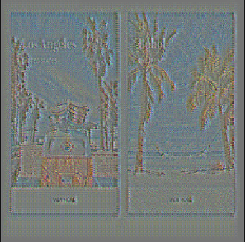
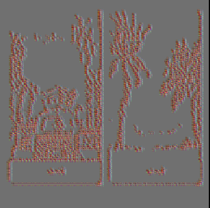
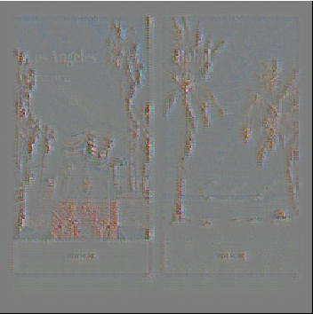
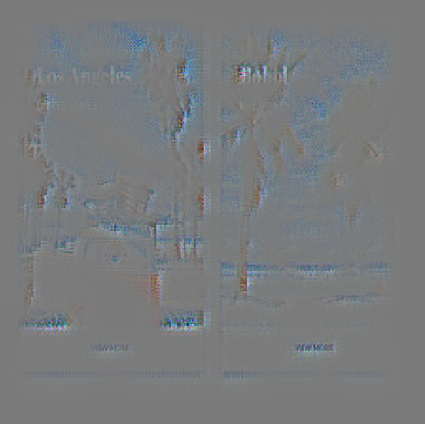
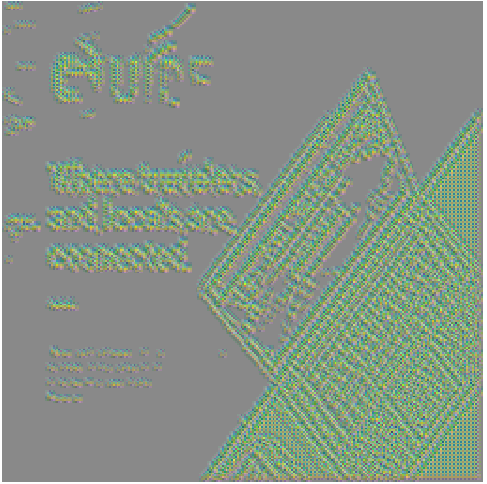
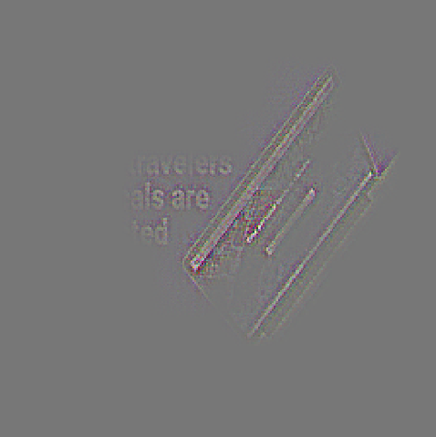
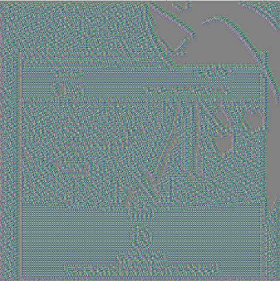

|   |   |   |   |   |
| :-----------: | :-----------: | :-----------: | :-----------: | :-----------: |
| Original Image | MaxPooling Layer 1| MaxPooling Layer 2 | MaxPooling Layer 3 | MaxPooling Layer 4 |
|  |  |  |  |  |
|  |  |  |  | |
|  |  |  |  |

Figure 1: Original image and the reconstructed versions from maxpool layer 1,2 and 3 of Alexnet generated using tf_cnnvis. 
